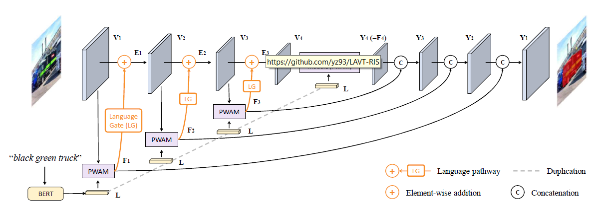
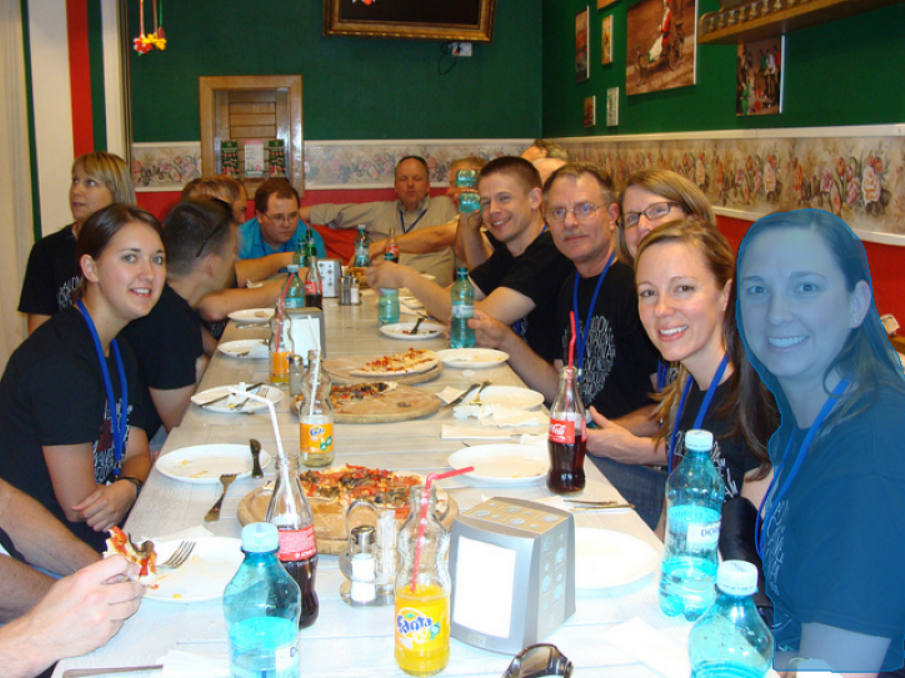

# LAVT: Language-Aware Vision Transformer for Referring Image Segmentation

> 对原论文的复现
>
> 论文链接: https://arxiv.org/abs/2112.02244
>
> 官方实现: https://github.com/yz93/LAVT-RIS 

## Architecture


## 特点
* 将不同模态feature的fusion提前到Image Encoder阶段
* 思路上对这两篇论文有很多借鉴
  
  * *Vision-Language Transformer and Query Generation for Referring Segmentation*
    
  
  * *Locate then Segment: A Strong Pipeline for Referring Image Segmentation*
    
* 采用了比较新的主干网络 Swin-Transformer

## 用法
详细参数设置可以见`args.py`

for training

```sh
CUDA_VISIBLE_DEVICES=0,1,2,3 python -m torch.distributed.launch --nproc_per_node 4 --master_port 12345 main.py --batch_size 2 --cfg_file configs/swin_base_patch4_window7_224.yaml --size 448
```

for evaluation

```sh
CUDA_VISIBLE_DEVICES=4,5,6,7 python -m torch.distributed.launch --nproc_per_node 4 --master_port 23458 main.py --size 448 --batch_size 1 --resume --eval --type val --eval_mode cat --pretrain ckpt_448_epoch_20.pth --cfg_file configs/swin_base_patch4_window7_224.yaml
```

for resume from checkpoint

```sh
CUDA_VISIBLE_DEVICES=0,1,2,3 python -m torch.distributed.launch --nproc_per_node 4 --master_port 12346 main.py --batch_size 2 --cfg_file configs/swin_base_patch4_window7_224.yaml --size 448 --resume --pretrain ckpt_448_epoch_10.pth
```


## 需要完善的地方

由于我在复现的时候，官方的code还没有出来,所以一些细节上的设置可能和官方code不同

* *Swin Transformer* 我选择的是 `swin_base_patch4_window12_384_22k.pth`,具体代码可以参考官方代码 https://github.com/microsoft/Swin-Transformer/blob/main/get_started.md 原论文中的图像resize的尺寸是480*480,可是我目前基于官方的代码若想调到这个尺寸，总是会报错,查了一下觉得可能用object detection 的swin transformer的code比较好
  > 12.27 这个问题目前也已经得到了较好的解决,目前训练用的是 `swin_base_patch4_window7_224_22k.pth`, 输入图片的尺寸调整到448*448 
  >
  > 解决方案可以参考:
  > 
  > https://github.com/microsoft/Swin-Transformer/issues/155
  

* 原论文中使用的lr_scheduler是*polynomial learning rate decay*, 没有给出具体的参数手动设置了一下
  > 12.21 目前来看感觉自己设置的不是很好
  >
  > 12.27 调整了一下设置,初始学习率的设置真的很重要,特别是根据`batch_size` 去scale你的 `inital learning rate`

* 原论文中的`batch_size=32`,基于自己的实验我猜想应该是用了8块GPU,每一块的`batch_size=4`, 由于我第一次写DDP code,训练时发现,程序总是会在RANK0上给其余RANK开辟类似共享显存的东西,导致我无法做到原论文相同的配置，需要改进

* 仔细观察Refcoco的数据集,会发现一个target会对应好几个sentence,training时我设计的是随机选一个句子,evaluate时感觉应该要把所有句子用上会更好,关于这一点我想了两种evaluate的方法
  > 目前eval 只能支持 `batch_size=1`
  * 将所有句子concatenate成为一个句子,送入BERT,Input 形式上就是(Image,cat(sent_1,sent_2,sent_3)) => model => pred
  > 实验发现这种`eval_mode` 下的`mean IOU` 会好不少, `overall_IOU` 也会好一点
  * 对同一张图片处理多次处理,然后将结果进行平均,Input 形式上就是 ((Image,sent_1),(Image,sent_2),(Image,sent_3)) => model => average(pred_1,pred_2,pred_3)

## 结果呈现

详细见`inference.ipynb`

input sentences
> 1. right girl
> 2. closest girl on right

results



